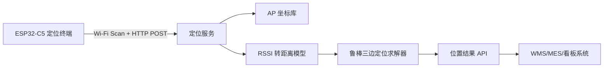

# 工厂料架定位系统总体设计

## 1. 项目目标

本项目基于 `ESP32-C5-WROOM-1` 构建一个安装在工厂料架或托盘上的智能终端。终端周期性扫描周边 5 GHz Wi-Fi AP，采集多个 AP 的 `BSSID/MAC`、`RSSI`、信道等信息，并通过连接回传网络中的一个 AP，将扫描结果经 HTTP 上报到上位定位系统。上位系统结合已知 AP 坐标完成室内定位。

这里需要先澄清一个工程事实：你描述的“**三角定位**”在 RSSI 场景里更准确叫“**多基站测距 + 三边定位（trilateration）**”，因为输入不是角度，而是用 RSSI 估计距离。由于工厂货架、金属反射、多路径会明显扰动 RSSI，推荐采用“**加权质心初值 + 鲁棒迭代三边定位 + 现场标定**”的混合方法，而不是单纯依赖三点几何解。

## 2. 系统架构



## 3. 终端硬件设计

### 3.1 功能划分

- 主控与无线：`ESP32-C5-WROOM-1`
- 供电：`5V USB-C` 输入，`3.3V LDO`
- 调试：`CP2102N USB-UART`
- 交互：`Reset`、`Boot`、状态 `LED`
- 可选扩展：单节锂电池、ADC 电压采样、I2C 传感器

### 3.2 关键器件选择

已在 [factory_locator_bom.csv](/D:/coding/C/esp-32-c5/esp-rps/hardware/factory_locator_bom.csv) 给出推荐型号。选型原则如下：

- `ESP32-C5-WROOM-1`：支持 2.4G/5G Wi-Fi 扫描能力，更适合你的场景
- `TLV75533`：噪声低、外围简单，足够驱动模组瞬时发射电流
- `CP2102N`：驱动成熟，适合开发和产测
- `TPD2EUSB30`：USB 口必须加 ESD 防护
- `MCP73831`：如果后续需要电池版本，成本低且成熟

### 3.3 原理图连接原则

详细连接关系见 [factory_locator_schematic.md](/D:/coding/C/esp-32-c5/esp-rps/hardware/factory_locator_schematic.md)。

建议你在正式画原理图时按以下网络命名：

- `VBUS_5V`
- `SYS_3V3`
- `ESP_EN`
- `ESP_BOOT`
- `UART0_TX`
- `UART0_RX`
- `BAT_SENSE`
- `STATUS_LED`

### 3.4 PCB 排布建议

- 模组必须放在板边，天线朝外，前方 15 mm 禁布铜和高器件
- 4 层板优先，L2 整层地，L3 走电源和低速控制
- `LDO` 靠近电源入口，`0.1uF` 去耦贴近模组供电脚
- USB 接口、ESD 和 `CP2102N` 放在板一端，射频区放在另一端
- 若设备安装在金属料架上，建议外加绝缘垫片，使天线离金属面至少 `20~30 mm`
- 若最终实测 RSSI 波动很大，优先考虑将终端放在料架侧边或塑胶外壳顶部，而不是完全贴近金属梁

### 3.5 结构与量产建议

- 开发阶段：USB 供电 + 外壳开孔调试
- 量产阶段：建议分成 `USB 调试板` 与 `低成本终端板` 两个 SKU
- 产测增加：
  - UART 自检
  - Wi-Fi 扫描自检
  - RSSI 采样稳定性抽检
  - 设备 MAC 与 SN 绑定

## 4. 固件设计

### 4.1 固件职责

- 连接工厂回传 Wi-Fi
- 周期扫描全部可见 AP
- 过滤并保留 RSSI 最强的若干 AP
- 生成 JSON 指纹数据
- 通过 HTTP POST 上传到定位服务
- 接收定位结果后可扩展本地缓存、LED 状态或串口调试输出

### 4.2 当前仓库已落地的固件文件

- [factory_locator_main.c](/D:/coding/C/esp-32-c5/esp-rps/main/factory_locator_main.c)

当前固件已经具备以下骨架能力：

- `ESP-IDF` 下初始化 `STA` 模式
- 自动重连回传 AP
- 阻塞式扫描周边 Wi-Fi
- 生成包含 `device_id`、`device_mac`、`timestamp_ms`、`scan_results` 的 JSON
- 经 `esp_http_client` POST 到上位系统

### 4.3 建议后续增强

- 把 `SSID/Password/Server URL` 改为 `NVS` 可配置
- 增加 HTTPS 与 token 鉴权
- 增加掉线缓存和批量补传
- 增加 OTA 升级
- 增加电池电压与设备健康状态上报

## 5. 上位定位系统设计

### 5.1 服务职责

- 接收终端上传的 AP 扫描结果
- 过滤未知 AP
- 从 AP 坐标库读取已知位置和模型参数
- 将 RSSI 转成距离估计
- 用鲁棒算法求位置
- 返回定位结果给 MES/WMS 或可视化页面

### 5.2 当前仓库已落地的 Spring Boot 服务文件

- 启动入口：
  [FactoryLocatorApplication.java](/D:/coding/C/esp-32-c5/esp-rps/server-java/src/main/java/com/factory/locator/FactoryLocatorApplication.java)
- 定位接口：
  [LocationController.java](/D:/coding/C/esp-32-c5/esp-rps/server-java/src/main/java/com/factory/locator/controller/LocationController.java)
- 定位算法服务：
  [PositioningService.java](/D:/coding/C/esp-32-c5/esp-rps/server-java/src/main/java/com/factory/locator/service/PositioningService.java)
- AP 坐标仓库：
  [AccessPointRepository.java](/D:/coding/C/esp-32-c5/esp-rps/server-java/src/main/java/com/factory/locator/repository/AccessPointRepository.java)
- Maven 工程文件：
  [pom.xml](/D:/coding/C/esp-32-c5/esp-rps/server-java/pom.xml)

这套实现现在已经是标准 `Spring Boot 3 + Maven + Java 17` Web 项目，可以直接作为你的正式上位系统起点。原来的 Python 示例仍然保留，主要用于算法对照和快速验证。

### 5.3 HTTP 协议

请求：

```json
{
  "device_id": "rack-tag-001",
  "device_mac": "A0:B7:65:11:22:33",
  "timestamp_ms": 1777195900000,
  "scan_results": [
    {
      "bssid": "24:6F:28:00:10:05",
      "ssid": "FACTORY-BACKHAUL",
      "rssi": -52,
      "primary_channel": 149,
      "secondary_channel": 0,
      "is_backhaul": true
    }
  ]
}
```

响应：

```json
{
  "device_id": "rack-tag-001",
  "position": {
    "lat": 31.2305,
    "lon": 121.4737,
    "floor": 1,
    "x_m": 4.32,
    "y_m": 6.18
  },
  "quality_score": 0.71,
  "ap_count_used": 5,
  "distances": [
    {
      "bssid": "24:6F:28:00:10:05",
      "rssi": -52,
      "estimated_distance_m": 3.16
    }
  ]
}
```

## 6. 定位算法设计

### 6.1 坐标系选择

尽管你现在手上是 AP 的经纬度，但**室内定位强烈建议转成工厂本地平面坐标系**，单位用米。例如：

- 原点：厂房左下角或某个固定基准点
- `x`：沿厂房长度方向
- `y`：沿厂房宽度方向
- `z/floor`：楼层或高度

原因：

- 经纬度适合地理坐标，不适合厂内米级分析和距离运算
- 料架位置、巷道宽度、误差热力图都更适合用米表示

目前示例代码里为了方便演示，保留了 `lat/lon -> local x/y` 的转换函数。

### 6.2 RSSI 转距离

采用对数路径损耗模型：

```text
d = 10 ^ ((RSSI_1m - RSSI) / (10 * n))
```

其中：

- `RSSI_1m`：AP 在 1 米处的标定 RSSI
- `n`：路径损耗指数，工厂内常在 `2.0 ~ 3.5`
- `d`：估计距离，单位米

### 6.3 求解流程

1. 选取 RSSI 最强的 `4~6` 个已知 AP。
2. 根据 RSSI 转成初始距离估计。
3. 用 `1 / d^2` 做加权质心，得到初值。
4. 最小化：

```text
sum( wi * ( ||p - pi|| - di )^2 )
```

其中：

- `p`：待求设备位置
- `pi`：第 i 个 AP 位置
- `di`：由 RSSI 估计的距离
- `wi`：鲁棒权重

5. 通过 Huber 风格的残差权重，削弱异常 RSSI。

### 6.4 为什么不推荐只做“三个点一次解”

- 工厂金属环境多路径严重
- 5 GHz 虽然带宽高，但遮挡更敏感
- 某一时刻三个 AP 的 RSSI 可能偏差很大

所以工程上更稳妥的是：

- 多 AP 融合
- 多次采样滑动平均
- 分区域标定 `n` 和 `RSSI_1m`
- 必要时叠加指纹库方法

## 7. Mock 数据与测试

当前仓库已提供：

- Java AP 坐标库：
  [ap_registry.json](/D:/coding/C/esp-32-c5/esp-rps/server-java/src/main/resources/mock-data/ap_registry.json)
- Java 扫描样例：
  [scan_example.json](/D:/coding/C/esp-32-c5/esp-rps/server-java/src/test/resources/mock-data/scan_example.json)
- Java 定位测试：
  [PositioningServiceTest.java](/D:/coding/C/esp-32-c5/esp-rps/server-java/src/test/java/com/factory/locator/PositioningServiceTest.java)

Python 版 mock 数据仍保留在 `server/mock_data` 目录，便于交叉验证算法结果。

Mock 数据用于：

- 联调终端 HTTP 上传格式
- 验证定位服务是否能正常返回位置
- 检查 RSSI 趋势和质量分是否合理

## 8. 现场部署与标定流程

### 8.1 AP 建库

- 记录每个 AP 的 `BSSID`
- 测量 AP 的安装点 `x/y/z` 坐标
- 记录楼层、天线高度、安装朝向

### 8.2 标定

每个区域选 `10~20` 个已知点位：

- 终端在点位静置 `30~60s`
- 采集多轮 RSSI
- 拟合每个区域的 `RSSI_1m` 与 `n`
- 对比真实位置和估计位置，输出平均误差和 95 分位误差

### 8.3 工程验收指标建议

- 平均误差：`<= 3 m`
- P95 误差：`<= 5 m`
- 定位刷新周期：`5~10 s`
- 数据上传成功率：`>= 99%`

## 9. 风险与改进建议

### 9.1 当前方案的主要风险

- 仅靠 Wi-Fi RSSI，在金属料架密集区误差可能较大
- AP 若负载变化、发射功率策略变化，会影响模型稳定性
- 终端安装位置如果紧贴金属，RSSI 分布会明显失真

### 9.2 建议的升级路径

- V1：Wi-Fi RSSI 多 AP 定位
- V2：加入 IMU 做运动平滑
- V3：加入 UWB/蓝牙 AoA 作为重点区域增强
- V4：按巷道建立指纹库，Wi-Fi 三边定位和指纹匹配融合

## 10. 下一步最值得立刻做的事

1. 用你真实工厂 AP 坐标替换 [ap_registry.json](/D:/coding/C/esp-32-c5/esp-rps/server-java/src/main/resources/mock-data/ap_registry.json)。
2. 把固件中的回传 `SSID/Password/Server URL` 改成你的现场参数。
3. 在厂房里挑 5 到 10 个已知点，采一轮真实 RSSI 数据。
4. 用真实数据拟合每个区域的 `path_loss_exponent`。
5. 再决定是否需要进一步引入指纹库或 UWB。
